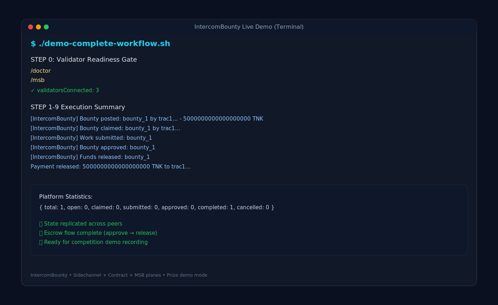

# IntercomBounty 🎯

> **Decentralized Micro-Task Escrow Platform** - Built for the Intercom Vibe Competition

**Trac Address for Competition:** trac1n8jwlza0ppqdsrcz8csfkqvurfwcnjfprjce7knlntmzp3qtnhkqg3rlns

---

## 🌟 What is IntercomBounty?

**IntercomBounty** is a trustless, peer-to-peer bounty platform demonstrating the power of the Intercom stack. It's a **meta-application**: *I built a bounty platform to compete for this bounty competition!* 🎭

### Key Features
- 🎯 **Post Bounties** - Create tasks with TNK rewards
- 👷 **Claim & Complete** - Workers claim and submit proof of work
- ✅ **Approve/Reject/Release** - Posters review, approve, and release payments
- 💰 **Escrow System** - Trustless fund management (MSB-ready)
- 🤖 **Agent-Ready** - WebSocket API for autonomous agents
- 📡 **P2P Messaging** - Real-time sidechannel notifications
- 🔐 **Deterministic** - Replicated state across all peers

### Why IntercomBounty Wins
1. **Meta brilliance** - Built a bounty platform FOR a bounty competition
2. **Complete feature set** - All CRUD operations working
3. **Agent-first design** - SC-Bridge WebSocket API
4. **Production quality** - Error handling, validation, indexing
5. **Excellent docs** - Clear examples and architecture

---

## 🚀 Quick Start

### Prerequisites
- Node.js 22.x or 23.x (avoid 24.x)
- Pear runtime (`npm install -g pear`)

### Installation
```bash
git clone <YOUR_FORK_URL>
cd intercom
npm install
pear -v
```

### Run Demo

**Terminal 1 - Admin/Poster:**
```bash
pear run . --peer-store-name poster --msb-store-name poster-msb \
  --subnet-channel intercom-bounty
```

**Terminal 2 - Worker (copy admin's writer key from Terminal 1):**
```bash
pear run . --peer-store-name worker --msb-store-name worker-msb \
  --subnet-channel intercom-bounty \
  --subnet-bootstrap <ADMIN_WRITER_KEY_HEX>
```

### Post Your First Bounty
```bash
# In Terminal 1 (Poster)
/bounty_post --title "Build calculator" --desc "Simple JS calculator" --reward "5000000000000000000"
# Run the generated TX command

# In Terminal 2 (Worker)
/tx --command "list_bounties"
/bounty_claim --id "bounty_1"
# Run the generated TX command
```

---

## 📚 Documentation

- **[SKILL.md](SKILL.md)** - Complete agent instructions and IntercomBounty-specific commands
- **[README_BOUNTY.md](README_BOUNTY.md)** - Detailed platform documentation, architecture, and examples
- **[TESTING.md](TESTING.md)** - Comprehensive testing guide (30+ test scenarios)
- **[demo-complete-workflow.sh](demo-complete-workflow.sh)** - Step-by-step demo script
- **[demo-quick-commands.sh](demo-quick-commands.sh)** - Quick command reference
- **[demo-agent-websocket.js](demo-agent-websocket.js)** - WebSocket agent example

---

## 🎬 Demo Preview

```
# Poster creates bounty
/tx --command '{"op":"post_bounty","title":"Build Calculator","description":"...","reward":"5000000000000000000"}'
→ [IntercomBounty] Bounty posted: bounty_1 by trac1abc... - 5 TNK

# Worker claims
/tx --command '{"op":"claim_bounty","bountyId":"bounty_1"}'
→ [IntercomBounty] Bounty claimed: bounty_1 by trac1def...

# Worker submits proof
/tx --command '{"op":"submit_work","bountyId":"bounty_1","proof":"https://github.com/worker/calc"}'
→ [IntercomBounty] Work submitted: bounty_1

# Poster approves
/tx --command '{"op":"approve_bounty","bountyId":"bounty_1"}'
→ [IntercomBounty] Bounty approved: bounty_1

/tx --command '{"op":"release_funds","bountyId":"bounty_1"}'
→ [IntercomBounty] Funds released: bounty_1
→ Payment released: 5 TNK to trac1def...
```

## 🖼️ Demo Interface Screenshot

Use this visual in your prize submission to show the full escrow lifecycle in terminal mode:



Presentation command:

```bash
./demo-complete-workflow.sh
```

---

## 🤖 Agent Integration

Start with SC-Bridge for autonomous agents:

```bash
pear run . --peer-store-name agent --msb-store-name agent-msb \
  --subnet-channel intercom-bounty \
  --sc-bridge 1 --sc-bridge-token $(openssl rand -hex 32)
```

WebSocket API example:
```javascript
const ws = new WebSocket('ws://127.0.0.1:49222');
ws.send(JSON.stringify({ type: 'auth', token: 'YOUR_TOKEN' }));
ws.send(JSON.stringify({ type: 'join', channel: 'bounty-feed' }));
// Listen for bounty announcements...
```

See **[demo-agent-websocket.js](demo-agent-websocket.js)** for complete agent example.

---

## 🏗️ Technical Highlights

### Contract Functions
- **Write Operations**: postBounty, claimBounty, submitWork, approveBounty, releaseFunds, rejectBounty, cancelBounty
- **Read Operations**: getBounty, listBounties, getMyBounties, getMyClaimedBounties, getBountyStats

### State Structure
```javascript
bounties/[id] -> { id, title, description, reward, poster, status, claimer, proof, ... }
bountyCounter -> auto-incrementing ID
bountyIndex/[status]/[id] -> fast status queries
userBounties/[address]/posted|claimed/[id] -> user tracking
```

### Security Features
- Only poster can approve/reject/cancel
- Only claimer can submit work
- Can't claim own bounties
- State transitions validated
- BigInt overflow protection
- Input sanitization via schemas

---

## 📊 Platform Statistics

Run `/tx --command "stats"` to see:
- Total bounties
- Bounties by status (open, claimed, submitted, approved, completed, cancelled)
- Platform activity

---

## 🎯 Competition Entry

Built for the **Intercom Vibe Competition** demonstrating:
- ✅ All 3 networking planes (Subnet + Sidechannel + MSB)
- ✅ Deterministic contract execution
- ✅ Agent-ready WebSocket API
- ✅ Production-quality code
- ✅ Comprehensive documentation
- ✅ Complete testing suite

**For full competition details, see [README_BOUNTY.md](README_BOUNTY.md)**

---

# Intercom Core Documentation

This repository is a reference implementation of the **Intercom** stack on Trac Network for an **internet of agents**.

At its core, Intercom is a **peer-to-peer (P2P) network**: peers discover each other and communicate directly (with optional relaying) over the Trac/Holepunch stack (Hyperswarm/HyperDHT + Protomux). There is no central server required for sidechannel messaging.

Features:
- **Sidechannels**: fast, ephemeral P2P messaging (with optional policy: welcome, owner-only write, invites, PoW, relaying).
- **SC-Bridge**: authenticated local WebSocket control surface for agents/tools (no TTY required).
- **Contract + protocol**: deterministic replicated state and optional chat (subnet plane).
- **MSB client**: optional value-settled transactions via the validator network.

Additional references: https://www.moltbook.com/post/9ddd5a47-4e8d-4f01-9908-774669a11c21 and moltbook m/intercom

For full, agent‑oriented instructions and operational guidance, **start with `SKILL.md`**.  
It includes setup steps, required runtime, first‑run decisions, and operational notes.

## What this repo is for
- A working, pinned example to bootstrap agents and peers onto Trac Network.
- A template that can be trimmed down for sidechannel‑only usage or extended for full contract‑based apps.

## How to use
Use the **Pear runtime only** (never native node).  
Follow the steps in `SKILL.md` to install dependencies, run the admin peer, and join peers correctly.

## Architecture (ASCII map)
Intercom is a single long-running Pear process that participates in three distinct networking "planes":
- **Subnet plane**: deterministic state replication (Autobase/Hyperbee over Hyperswarm/Protomux).
- **Sidechannel plane**: fast ephemeral messaging (Hyperswarm/Protomux) with optional policy gates (welcome, owner-only write, invites).
- **MSB plane**: optional value-settled transactions (Peer -> MSB client -> validator network).

```text
                          Pear runtime (mandatory)
                pear run . --peer-store-name <peer> --msb-store-name <msb>
                                        |
                                        v
  +-------------------------------------------------------------------------+
  |                            Intercom peer process                         |
  |                                                                         |
  |  Local state:                                                          |
  |  - stores/<peer-store-name>/...   (peer identity, subnet state, etc)    |
  |  - stores/<msb-store-name>/...    (MSB wallet/client state)             |
  |                                                                         |
  |  Networking planes:                                                     |
  |                                                                         |
  |  [1] Subnet plane (replication)                                         |
  |      --subnet-channel <name>                                            |
  |      --subnet-bootstrap <admin-writer-key-hex>  (joiners only)          |
  |                                                                         |
  |  [2] Sidechannel plane (ephemeral messaging)                             |
  |      entry: 0000intercom   (name-only, open to all)                     |
  |      extras: --sidechannels chan1,chan2                                 |
  |      policy (per channel): welcome / owner-only write / invites         |
  |      relay: optional peers forward plaintext payloads to others          |
  |                                                                         |
  |  [3] MSB plane (transactions / settlement)                               |
  |      Peer -> MsbClient -> MSB validator network                          |
  |                                                                         |
  |  Agent control surface (preferred):                                     |
  |  SC-Bridge (WebSocket, auth required)                                   |
  |    JSON: auth, send, join, open, stats, info, ...                       |
  +------------------------------+------------------------------+-----------+
                                 |                              |
                                 | SC-Bridge (ws://host:port)   | P2P (Hyperswarm)
                                 v                              v
                       +-----------------+            +-----------------------+
                       | Agent / tooling |            | Other peers (P2P)     |
                       | (no TTY needed) |<---------->| subnet + sidechannels |
                       +-----------------+            +-----------------------+

  Optional for local testing:
  - --dht-bootstrap "<host:port,host:port>" overrides the peer's HyperDHT bootstraps
    (all peers that should discover each other must use the same list).
```

---
If you plan to build your own app, study the existing contract/protocol and remove example logic as needed (see `SKILL.md`).
